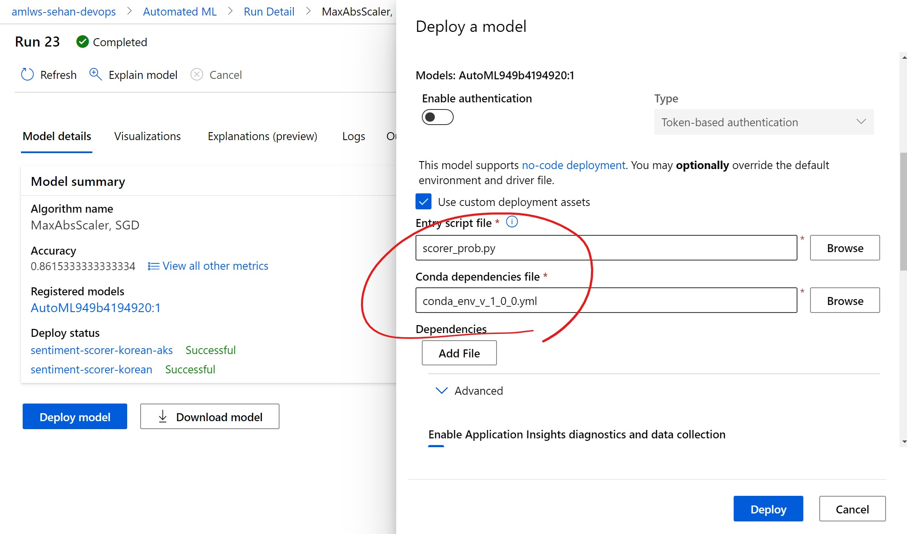

# sentiment-score-korean

Use Naver Sentiment Movie Corpus (https://github.com/e9t/nsmc) and Azure ML to create a sentiment classifier for Korean.

---

## Overview

### What's inside

### How it works

---

## Technologies Used

### Azure Machine Learning studio

### Python SDK for Azure Machine Learning

---

## Installation and Usage

```bash
git clone https://github.com/AIDemoWarriors/sentiment-score-korean
cp config.json.dist config.json
vi config.json
```

If you want to download already trained ML model, download [this file](https://aidemowarriors.blob.core.windows.net/sentiment-scorer-korean/azureml-models/AutoML949b4194920/1/model.pkl) and save it under `.\\azureml-models\\AutoML949b4194920\\1\\`. Check out [how model management works in Azure ML](https://docs.microsoft.com/en-us/azure/machine-learning/concept-model-management-and-deployment#register-and-track-ml-models)

Else if you want to use your own ML model (trained with Automated ML from Azure ML), modify the `config.json` to connect to the Azure Machine Learning Workspace, where your model can be created and registered.

```bash
cp config.json.dist config.json
vi config.json
```

If you want to download already trained ML model, download [this file](https://aidemowarriors.blob.core.windows.net/sentiment-scorer-korean/azureml-models/AutoML949b4194920/1/model.pkl) and save it under `.\\azureml-models\\AutoML949b4194920\\1\\`. Check out [how model management works in Azure ML](https://docs.microsoft.com/en-us/azure/machine-learning/concept-model-management-and-deployment#register-and-track-ml-models)

Else if you want to use your own ML model (trained with Automated ML from Azure ML), modify the `config.json` to connect to the Azure Machine Learning Workspace, where your model can be created and registered.

```bash
cp config.json.dist config.json
vi config.json
```

Enjoy!

---

## Notes and Features

### Use endpoint created from Automated ML model out-of-the-box

Azure ML Automated ML supports no-code deployment - meaning the scoring logic and conda environment are automatically created for you. You can do this from Automated ML menu.

If you chose Classification from Automated ML, the basic scorer returns the predicted class without the probability. The basic scorer is found under `Outputs` from Azure ML model detail page (for example, `scoring_file_v_1_0_0.py`). For your convenience the file is copied in this repo: [./automl_scoring/scorer_orig.py](./automl_scoring/scorer_orig.py).

If you want probability together, follow below instruction.

### Use Automated ML model with custom scoring

[./automl_scoring/score_prob.py](./automl_scoring/scorer_prob.py) is a modified version, which shows probability of each prediction along with the predicted class. It also includes the input data for convenience.

You can specify this scoring file and conda environment when you deploy Automated ML model to ACI/AKS. [./test_sentiment_prob_cloud.py](./test_sentiment_prob_cloud.py) should look at the service created in that way.



[./test_sentiment_prob_local.py](./test_sentiment_prob_local.py) is using the model itself and locally gets and shows the probability.

---

## Ideas for Future Development

---

## License

[LICENSE](LICENSE)

---

## References
